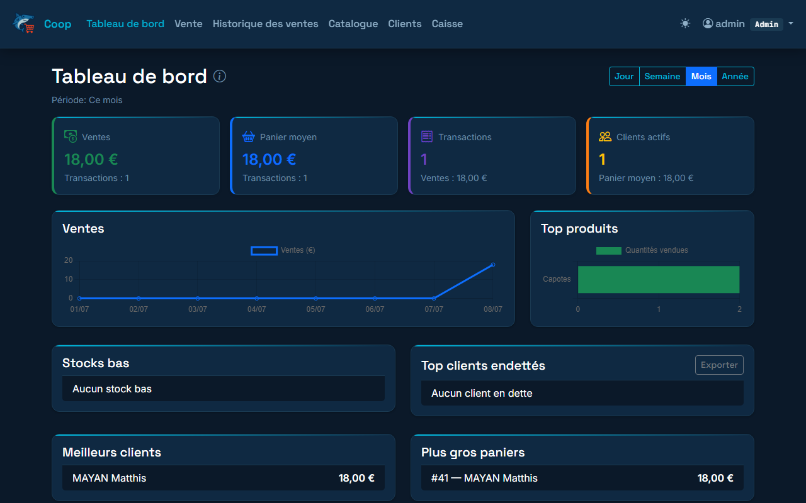
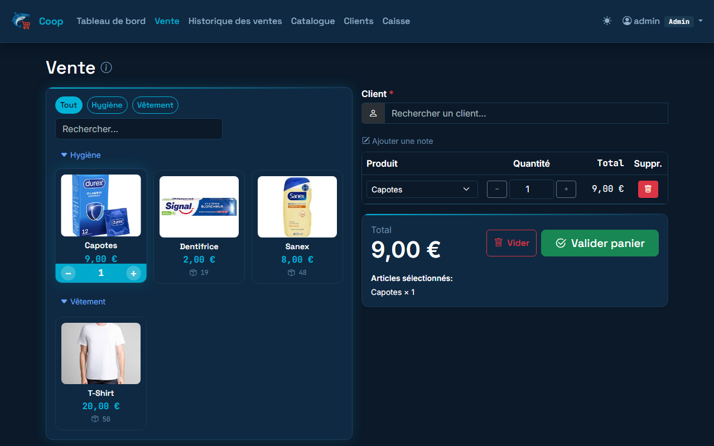
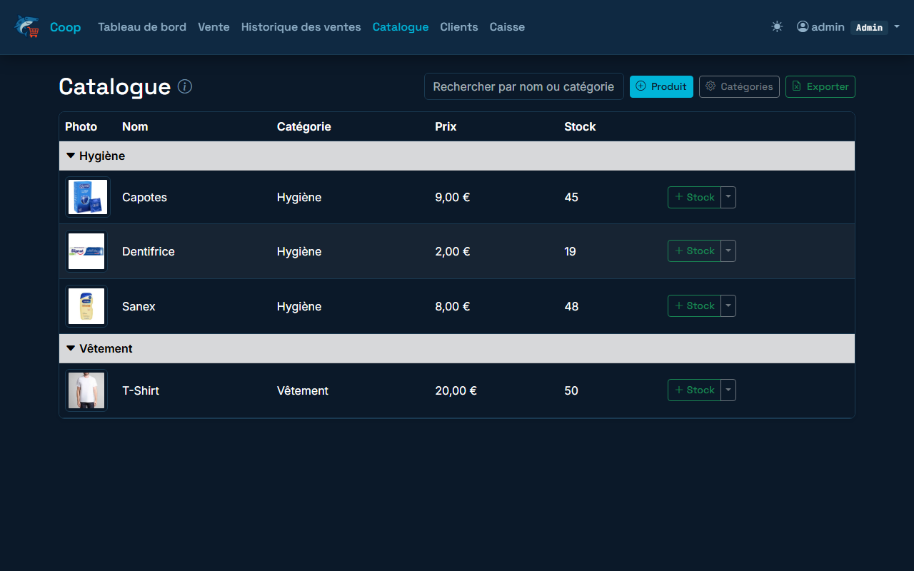
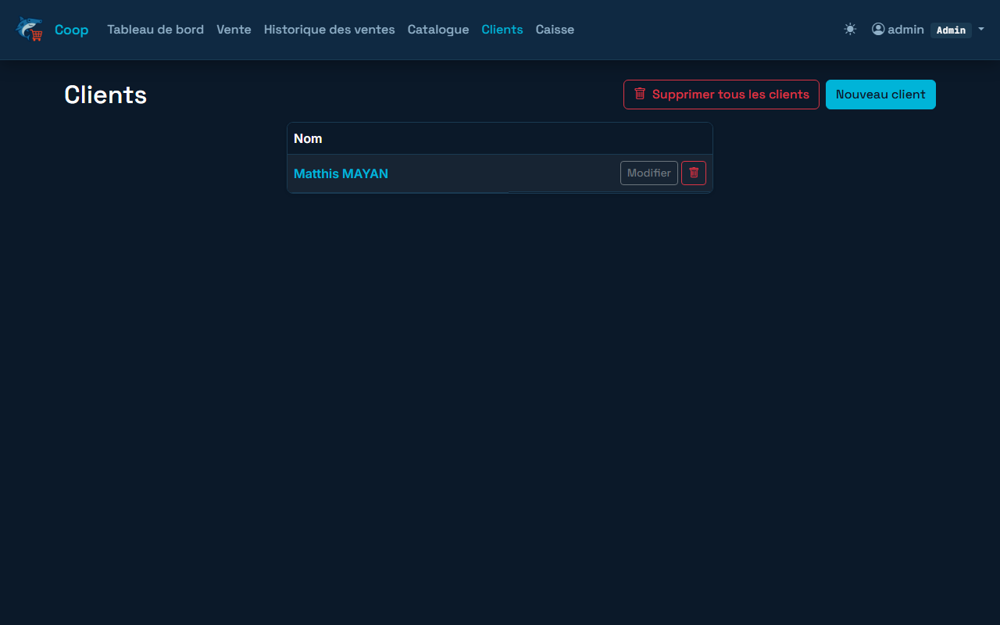
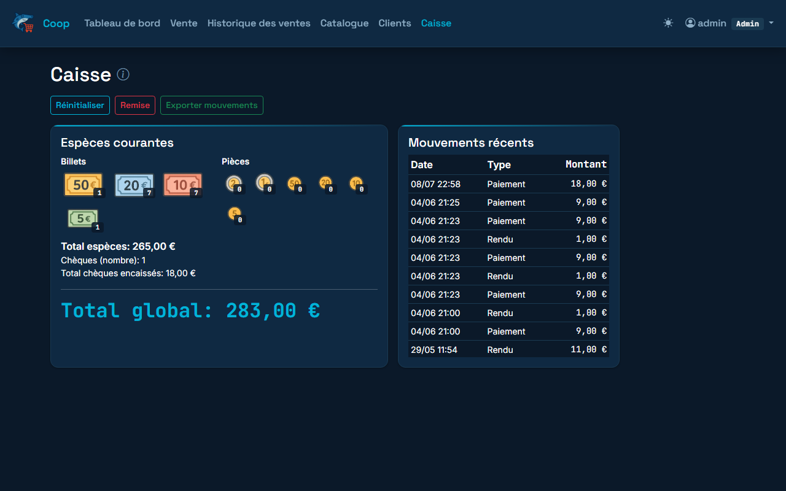

# Coop POS

Caisse enregistreuse Django pour coopérative. Gestion des ventes, clients, stocks, dettes et caisse.

---

## Aperçu

### Tableau de bord — statistiques du mois, graphique jour par jour, alertes stock


### Kiosk de vente — grille produits, overlay quantité +/−, panier temps réel


### Catalogue — stocks par catégorie, ajout rapide


### Clients — liste, fiche client, dettes


### Caisse — détail par billet/pièce, mouvements récents


---

## Fonctionnalités

- **Kiosk de vente** : grille produits par catégorie, overlay quantité +/− directement sur les cartes, recherche rapide, filtre par catégorie
- **Paiements** : espèces avec rendu monnaie automatique, chèque, autre, vente à crédit (dette)
- **Historique des ventes** avec suppression individuelle (options : remise en stock + annulation caisse)
- **Catalogue produits** avec gestion des stocks (ajout, ajustement ±, historique des mouvements)
- **Tableau de bord** avec statistiques, graphique jour par jour sur le mois en cours, top produits, top clients, alertes stock bas
- **Gestion de caisse** : fond de caisse, remises, mouvements, comptage par dénomination
- **Exports Excel** (ventes, dettes, catalogue, mouvements caisse) et **reçus PDF**
- **Authentification** à deux rôles : Admin et Caissier
- **Thème clair/sombre** avec toggle dans la navbar (mémorisé)
- **Gestion des utilisateurs** simplifiée (sans passer par le Django admin)

---

## Installation développement (local, sans Docker)

**Prérequis** : Python 3.11+

```powershell
git clone https://github.com/Mattrix2211/Coop.git
cd Coop
python -m venv .venv
.venv\Scripts\activate
pip install -r requirements.txt

python manage.py migrate
python manage.py setup_groups     # crée les groupes + superuser admin/admin123
python manage.py runserver 8001 --noreload
```

Accéder à `http://127.0.0.1:8001/` — vous serez redirigé vers la page de connexion.

---

## Installation production (Docker + PostgreSQL)

**Prérequis** : Docker et Docker Compose installés.

```bash
cp .env.example .env
# Éditer .env : SECRET_KEY, DB_PASSWORD, ALLOWED_HOSTS
docker-compose up --build -d
```

L'application est disponible sur `http://localhost:8000/`.

Au premier démarrage, les migrations sont appliquées et les groupes créés automatiquement. Le superuser `admin` (mot de passe `admin123`) est créé s'il n'existe pas — **changez-le immédiatement** via Réglages → Modifier.

---

## Comptes et rôles

| Rôle | Accès |
|------|-------|
| **Admin** (superuser ou groupe Admin) | Toutes les fonctionnalités : créer/modifier/supprimer produits, catégories, clients, ventes ; vider l'historique ; réglages utilisateurs |
| **Caissier** (groupe Caissier) | Ventes, historique, catalogue (lecture + ajout stock), clients (lecture), caisse, exports |

### Gérer les utilisateurs

Connectez-vous en admin → menu utilisateur (haut droite) → **Réglages utilisateurs**.

---

## Variables d'environnement

| Variable | Défaut | Description |
|----------|--------|-------------|
| `SECRET_KEY` | clé dev | Clé secrète Django — **obligatoire en prod** |
| `DEBUG` | `True` | Passer à `False` en production |
| `ALLOWED_HOSTS` | `localhost,127.0.0.1` | Hostnames autorisés (séparés par virgule) |
| `DB_HOST` | *(vide)* | Si défini → PostgreSQL ; sinon → SQLite |
| `DB_NAME` | `coop` | Nom de la base de données |
| `DB_USER` | `coop` | Utilisateur PostgreSQL |
| `DB_PASSWORD` | — | Mot de passe PostgreSQL |
| `DB_PORT` | `5432` | Port PostgreSQL |

---

## URLs clés

| URL | Description |
|-----|-------------|
| `/` | Dashboard |
| `/login/` | Page de connexion |
| `/sales/new/` | Kiosk — nouvelle vente |
| `/sales/` | Historique des ventes |
| `/products/` | Catalogue produits |
| `/customers/` | Liste des clients |
| `/cash/` | Tableau de bord caisse |
| `/settings/users/` | Gestion des utilisateurs (Admin) |

---

## Stack technique

- **Backend** : Django 5.1, Python 3.13
- **Base de données** : PostgreSQL (prod) / SQLite (dev)
- **Frontend** : Bootstrap 5.3, vanilla JS, [MK Design System v2.0](https://github.com/Mattrix2211/design-system) (palette Navy/Signal, Space Grotesk + Inter + JetBrains Mono)
- **Exports** : openpyxl (Excel), ReportLab (PDF)
- **Serveur** : Gunicorn + Whitenoise (fichiers statiques)
