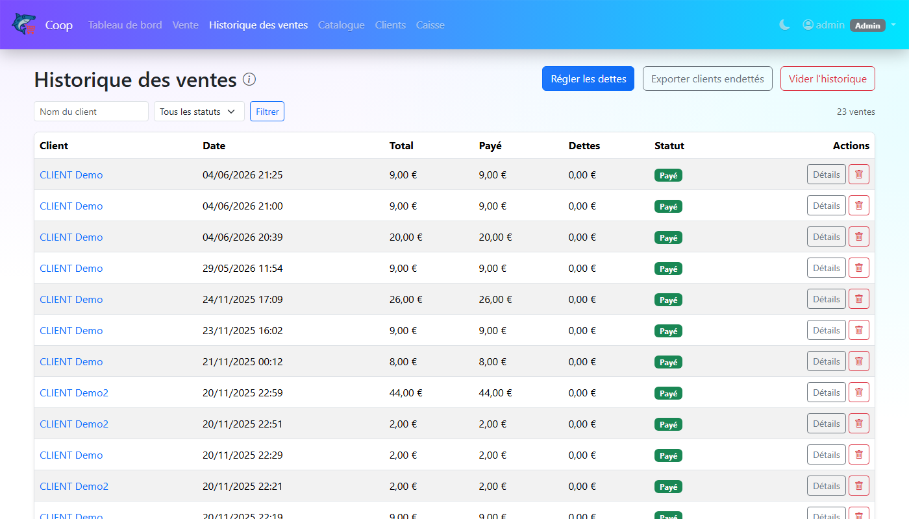

# Guide utilisateur — Coop POS

Application de caisse enregistreuse pour coopérative.

---

## Table des matières

1. [Connexion / Déconnexion](#1-connexion--déconnexion)
2. [Thème clair / sombre](#2-thème-clair--sombre)
3. [Tableau de bord](#3-tableau-de-bord)
4. [Faire une vente (kiosk)](#4-faire-une-vente-kiosk)
5. [Historique des ventes](#5-historique-des-ventes)
6. [Gérer les dettes](#6-gérer-les-dettes)
7. [Catalogue produits](#7-catalogue-produits)
8. [Gérer les clients](#8-gérer-les-clients)
9. [Caisse](#9-caisse)
10. [Exports](#10-exports)
11. [Réglages utilisateurs (Admin)](#11-réglages-utilisateurs-admin)

---

## 1. Connexion / Déconnexion

Ouvrez l'application dans votre navigateur. Saisissez votre **nom d'utilisateur** et votre **mot de passe**, puis cliquez sur **Se connecter**.

Pour vous déconnecter : cliquez sur votre nom en haut à droite → **Déconnexion**.

> **Rôles** : **Admin** (accès complet) ou **Caissier** (accès limité). Les boutons et actions non autorisés ne sont pas affichés pour les Caissiers.

---

## 2. Thème clair / sombre

Cliquez sur l'icône **lune** ou **soleil** dans la barre de navigation pour basculer entre thème clair et sombre. Le choix est mémorisé dans votre navigateur.

---

## 3. Tableau de bord

Vue d'ensemble de l'activité :

- **Chiffre d'affaires**, **panier moyen**, **nombre de transactions**, **clients actifs** sur la période
- **Graphique des ventes jour par jour** — par défaut sur le mois en cours
- **Top 5 produits** (quantités vendues) et **Top 5 clients** (CA)
- **Alertes stock bas** (produits sous leur seuil minimum)
- **Top clients endettés** et bouton export
- **Plus gros paniers** et **Ventes récentes**

### Changer la période

Utilisez les boutons **Jour / Semaine / Mois / Année** en haut à droite.

---

## 4. Faire une vente (kiosk)

### Étape 1 — Sélectionner les produits

- Les produits sont affichés en grille, regroupés par catégorie.
- **Cliquez** sur une carte pour ajouter l'article au panier.
- Une fois ajouté, un **bandeau bleu** apparaît en bas de la carte avec **[−] quantité [+]** — ajustez la quantité directement depuis la carte sans toucher au tableau panier.
- Utilisez la **barre de recherche** ou les **filtres par catégorie** pour trouver rapidement un article.
- Le **stock disponible** est affiché sous le prix de chaque article.
- Si un article est en rupture (stock = 0), sa carte est grisée et non cliquable.

### Étape 2 — Sélectionner le client

Tapez le nom dans le champ **Client** — les suggestions apparaissent immédiatement. Cliquez sur un nom pour le sélectionner. Le client est obligatoire pour valider la vente.

### Étape 3 — Note (optionnel)

Cliquez sur **Ajouter une note** pour dérouler le champ de note libre.

### Étape 4 — Valider le panier

Cliquez sur **Valider panier**. La fenêtre de paiement s'ouvre.

### Étape 5 — Paiement

**Espèces** : sélectionnez l'onglet Espèce, cliquez sur les billets/pièces remis. Le montant donné et le **rendu monnaie** sont calculés automatiquement.

**Chèque ou Autre** : sélectionnez l'onglet correspondant, saisissez le montant.

**À crédit** : cliquez sur **Encaisser** sans entrer de montant — la vente est enregistrée avec un solde à régler.

### Étape 6 — Reçu

Le reçu s'affiche automatiquement. Vous pouvez le télécharger en **PDF**. Le panier est vidé et l'app est prête pour la vente suivante.

> **Bouton Vider** : efface tout le panier en un clic.

---

## 5. Historique des ventes

Liste de toutes les ventes avec filtres par client et statut.

| Bouton | Description |
|--------|-------------|
| **Détails** | Affiche le reçu complet en fenêtre |
| **Régulariser** | Enregistre un paiement sur une vente impayée |
| **Régler les dettes** | Paiement groupé sur toutes les dettes d'un client |
| **Supprimer** *(Admin)* | Supprime la vente avec options |
| **Vider l'historique** *(Admin)* | Supprime toutes les ventes |

### Supprimer une vente *(Admin)*

Une fenêtre s'ouvre avec deux options (toggles) :

- **Remettre les produits en stock** — les quantités achetées sont réintégrées au catalogue
- **Annuler les mouvements de caisse** — le comptage caisse revient à l'état avant la vente

Les deux options sont activées par défaut.

---

## 6. Gérer les dettes

### Régler une dette individuelle

Depuis l'historique → **Régulariser** → saisissez le montant et la méthode → **Valider**.

### Règlement groupé par client

**Régler les dettes** (en haut de l'historique) → sélectionnez le client → saisissez le montant global. Le système répartit du plus ancien au plus récent.

---

## 7. Catalogue produits

| Action | Description |
|--------|-------------|
| **+ Stock** | Ajoute une quantité au stock existant |
| **Ajuster stock** *(Admin)* | Delta +/− avec note obligatoire |
| **Modifier / Supprimer** *(Admin)* | Édite ou supprime le produit |
| **Historique stock** | Journal de tous les mouvements |
| **+ Produit** *(Admin)* | Crée un nouveau produit |
| **Catégories** *(Admin)* | Gère les catégories |

---

## 8. Gérer les clients

- **Créer** : bouton **Nouveau client**
- **Modifier / Supprimer** *(Admin)* : boutons sur chaque ligne
- **Fiche client** : cliquez sur le nom pour voir toutes ses ventes, total acheté, dette

---

## 9. Caisse

### Initialiser le fond de caisse

**Réinitialiser** → saisissez les quantités de chaque billet/pièce → **Valider**. Ferme l'ancienne session et ouvre une nouvelle. À faire en début de journée.

### Remise de caisse

**Remise** → saisissez les billets/pièces retirés → **Valider**. Enregistre un retrait d'espèces (versement en banque, mise en coffre…).

### Ce que vous voyez

- **Espèces courantes** : détail par billet/pièce, mis à jour à chaque vente
- **Chèques** : total des paiements par chèque sur la session
- **Total global** : espèces + chèques
- **Mouvements récents** : les 25 derniers mouvements

---

## 10. Exports

Tous les exports sont au format Excel (`.xlsx`).

| Export | Depuis |
|--------|--------|
| Ventes | Page historique des ventes |
| Clients endettés | Page historique des ventes |
| Catalogue produits | Page catalogue |
| Mouvements caisse | Page caisse |

**Reçu PDF** : dans la fenêtre de détail d'une vente → **PDF**.

---

## 11. Réglages utilisateurs (Admin)

Accessible via le menu utilisateur (haut droite) → **Réglages utilisateurs**.

### Créer un utilisateur

**Nouvel utilisateur** → renseignez prénom, nom, nom d'utilisateur, mot de passe et rôle → **Créer**.

### Modifier un utilisateur

**Modifier** → changez le nom, le rôle ou le mot de passe (laisser vide pour ne pas changer) → **Enregistrer**.

### Supprimer un utilisateur

Icône poubelle → confirmer. Impossible de supprimer son propre compte.

### Rôles disponibles

| Rôle | Description |
|------|-------------|
| **Admin** | Accès complet à toutes les fonctionnalités |
| **Caissier** | Ventes, caisse, catalogue (lecture + ajout stock), exports |
